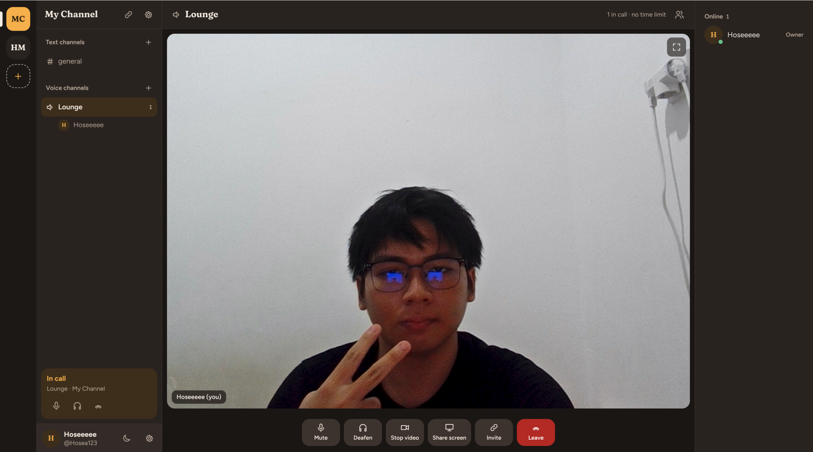
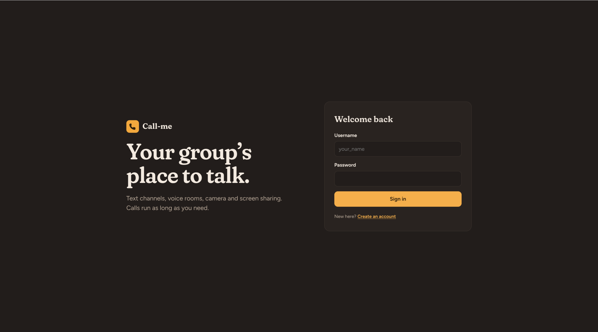
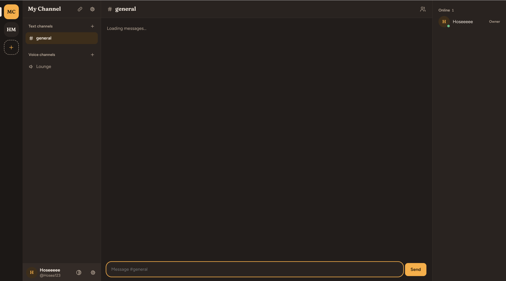
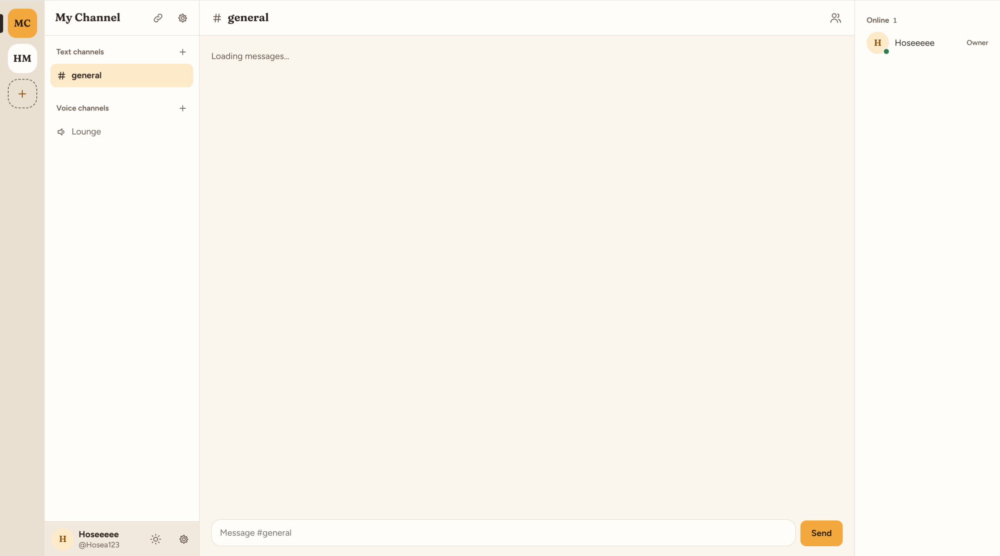
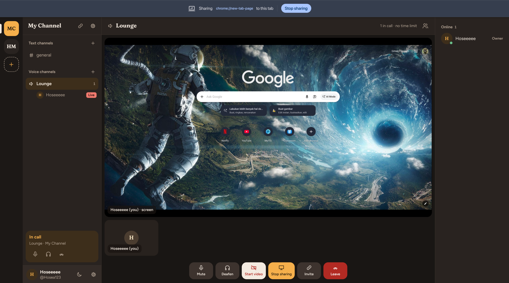

# Call-me

Self-hosted voice, video and chat for a group. It's organised like Discord (spaces with text and voice channels) and works like Zoom (one click gives you a meeting and a link to share). Calls have no time limit.



- **Spaces** with text and voice channels, roles (owner, admin, member), invite links, kick and ban
- **Calls**: voice, camera, screen sharing, mute and deafen, speaking indicators, focus view
- **Instant meetings**: one click creates a room and an invite link
- **Chat** with typing indicators, unread markers, day dividers, clickable links, and history that loads as you scroll up
- Light and dark themes, and it works on phones

**Try it with friends in two commands:** `npm install`, then [`npm run tunnel`](#option-b-no-domain-from-your-own-computer) prints a public HTTPS address anyone can open.

**Contents:** [Run it on Debian](#run-it-on-debian) · [User manual](#user-manual) · [Configuration](#configuration) · [Deploy it](#deploy-it) · [Troubleshooting](#troubleshooting) · [Security model](#security-model) · [Development](#development)

---

## Run it on Debian

Call-me needs **Node.js 22.13 or newer** because it uses the built-in `node:sqlite`. The `nodejs` package in Debian's own repositories is often older, so check first:

```sh
node --version
```

If it's missing or below 22.13, install Node 22 (or newer) from NodeSource:

```sh
curl -fsSL https://deb.nodesource.com/setup_22.x | sudo -E bash -
sudo apt install -y nodejs
```

Then install and start the app:

```sh
cd Callme
npm install
npm start
```

Open <http://localhost:3000> and create an account. The database is stored at `data/callme.db`.

Browsers only allow camera and microphone on `localhost` or over HTTPS. Other devices on your network can't join calls through `http://<your-ip>:3000`. To use it from other devices, [deploy it](#deploy-it) behind HTTPS.

---

## User manual

### Accounts



- **Create an account** from the sign-in screen with *Create an account*. Your username is 3 to 32 letters, numbers, `_`, `.` or `-`, and your password must be at least 10 characters. Your display name is what other people see.
- **Your settings** is the gear icon at the bottom of the left sidebar. You can change your display name, theme and password there, or sign out. Changing your password signs out all your other devices.
- **Theme**: the half-circle, sun or moon icon next to your settings switches between *match system*, *light* and *dark*. The browser remembers your choice.

| Dark | Light |
| --- | --- |
|  |  |

### Spaces

A space is a permanent home for a group, with its own channels and members. Your spaces are listed as round buttons in the far-left rail. A small tab beside a space means it has unread messages.

Click **+** in the rail to:

| Option | What it does |
| --- | --- |
| **Start a meeting now** | Creates a space with a voice room, puts you in the call and shows an invite link valid for 7 days. |
| **Create a space** | Creates a space with a `#general` text channel and a *Lounge* voice channel. |
| **Join with an invite** | Paste an invite link or code someone sent you. |

### Inviting people

Click the link icon next to the space name, or **Invite** during a call. Choose how long the link lasts (1 hour to never) and how many times it can be used, then copy it. Anyone with the link can create an account and join, so only share it with people you trust.

When someone opens an invite link while signed out, they're asked to sign in or create an account, and then they can accept the invite.

### Text channels

- Press **Enter** to send and **Shift+Enter** for a new line. Messages can be up to 4000 characters.
- Links starting with `http://` or `https://` become clickable and open in a new tab.
- Scroll up to load older messages.
- Hover over a message and click the trash icon to delete it. You can delete your own messages; admins and owners can delete anyone's.
- Channels with new messages are shown in bold with a dot.

### Voice channels and calls

Open a voice channel and click **Join call**. Your mic is on when you join. Camera and screen sharing stay off until you turn them on. If the browser blocks the mic, you join listen-only.

| Control | What it does |
| --- | --- |
| **Mute / Unmute** | Turns your microphone off or on. |
| **Deafen / Undeafen** | Silences everyone else and mutes you. Undeafen brings your mic back to how it was before. Unmuting while deafened also undeafens you. |
| **Start / Stop video** | Turns your camera on or off. |
| **Share screen** | Shares a screen, window or tab. It appears as its own tile. |
| **Invite** | Creates an invite link for this space. |
| **Leave** | Leaves the call. |



- A **marigold ring** shows who is speaking, both on the video tile and in the sidebar.
- Click the expand icon on a tile to **focus** it (useful for screen shares). Click the X to go back to the grid.
- While you're in a call, the panel at the bottom of the sidebar keeps your mute, deafen and leave controls handy as you move between channels.
- You can be in one call at a time. Joining a call from another tab or device moves you there.

### Roles and moderation

| Action | Member | Admin | Owner |
| --- | :---: | :---: | :---: |
| Chat, join calls, create invite links | ✓ | ✓ | ✓ |
| Delete other people's messages | | ✓ | ✓ |
| Rename the space, add, rename or delete channels | | ✓ | ✓ |
| See and revoke invite links | | ✓ | ✓ |
| Remove or ban members ranked below you | | ✓ | ✓ |
| Change roles, transfer ownership, delete the space | | | ✓ |

Open these from the gear icon next to the space name. **Remove** lets the person rejoin with a new invite. **Ban** stops them rejoining through any invite. Owners can't leave a space. They transfer ownership first or delete the space.

### On a phone

Tap the menu icon at the top left for spaces and channels, and the people icon at the top right for the member list. Tap outside a panel to close it.

---

## Configuration

Call-me reads environment variables only. It doesn't load `.env` files itself, so set them in your systemd unit, hosting dashboard or shell. `.env.example` has a template.

| Variable | Default | Purpose |
| --- | --- | --- |
| `NODE_ENV` | (unset) | Set to `production` for Secure cookies and HSTS. Required when served over HTTPS. |
| `HOST` | `127.0.0.1` | Address to listen on. Keep loopback behind a reverse proxy. Use `0.0.0.0` on container platforms. |
| `PORT` | `3000` | Port to listen on. |
| `ALLOWED_ORIGINS` | `http://localhost:PORT` | Comma-separated public URL(s), e.g. `https://call.example.com`. Requests and WebSockets from other origins are rejected, so this must match the address in the browser exactly. |
| `DB_PATH` | `data/callme.db` | SQLite database file. Put it on persistent storage. |
| `TRUST_PROXY` | (unset) | Set to `1` only behind a reverse proxy, so rate limits use the real client IP. |
| `ICE_SERVERS` | Google STUN | JSON array of STUN/TURN servers, e.g. for a hosted TURN service. |
| `TURN_URLS` | (unset) | Comma-separated coturn URLs, used together with `TURN_SECRET`. |
| `TURN_SECRET` | (unset) | coturn `static-auth-secret`. Clients get 12-hour credentials, never the secret. |
| `TURN_TTL_SEC` | `43200` | Lifetime of those TURN credentials. |

`GET /healthz` returns `ok` when the server and database are working. Point your host's health check at it.

---

## Deploy it

Call-me is one long-running Node process that holds WebSocket connections and writes to a SQLite file. It **won't run on Vercel, Netlify or other serverless hosts**. They can't keep WebSockets open, and their disks are wiped between runs.

### Option A: your own server with a domain (recommended)

For a Debian VPS with a domain pointing at it:

**1. Install the app**

```sh
sudo useradd -r -m -d /opt/callme callme
sudo -u callme git clone <your-repo-url> /opt/callme/app
cd /opt/callme/app && sudo -u callme npm ci --omit=dev
sudo mkdir -p /var/lib/callme && sudo chown callme: /var/lib/callme
```

**2. Run it as a service.** Create `/etc/systemd/system/callme.service`:

```ini
[Unit]
Description=Call-me
After=network.target

[Service]
User=callme
WorkingDirectory=/opt/callme/app
ExecStart=/usr/bin/node server/index.js
Environment=NODE_ENV=production
Environment=HOST=127.0.0.1
Environment=PORT=3000
Environment=ALLOWED_ORIGINS=https://call.example.com
Environment=DB_PATH=/var/lib/callme/callme.db
Environment=TRUST_PROXY=1
Restart=always

[Install]
WantedBy=multi-user.target
```

```sh
sudo systemctl daemon-reload
sudo systemctl enable --now callme
```

**3. Add HTTPS with Caddy.** Caddy gets and renews the certificate on its own:

```sh
sudo apt install -y caddy
```

`/etc/caddy/Caddyfile`:

```
call.example.com {
  reverse_proxy 127.0.0.1:3000
}
```

```sh
sudo systemctl reload caddy
```

Only ports 80 and 443 need to be open to the internet.

**4. Add TURN for difficult networks.** Calls connect people directly. People behind strict NATs, mobile carriers or company firewalls often need a relay. Install coturn on the same server:

```sh
sudo apt install -y coturn
```

In `/etc/turnserver.conf`, set `use-auth-secret`, `static-auth-secret=<long random string>`, `realm=call.example.com` and your TLS certificate paths. Open ports 3478 and 5349 plus the relay UDP range (`min-port`/`max-port`). Then add to the service:

```ini
Environment=TURN_URLS=turns:call.example.com:5349,turn:call.example.com:3478
Environment=TURN_SECRET=<the same secret>
```

### Option B: no domain, from your own computer

A Cloudflare quick tunnel gives the Call-me running on your computer a public HTTPS address, like `https://random-words.trycloudflare.com`. You don't need a domain, a Cloudflare account or any open ports.

**1. Install cloudflared.** You only do this once, and it doesn't need sudo:

```sh
mkdir -p ~/.local/bin
curl -fsSL -o ~/.local/bin/cloudflared https://github.com/cloudflare/cloudflared/releases/latest/download/cloudflared-linux-amd64
chmod +x ~/.local/bin/cloudflared
~/.local/bin/cloudflared --version
```

If `~/.local/bin` isn't on your `PATH`, add it, or pass the full path as shown in step 2. On a Raspberry Pi or other ARM board, download `cloudflared-linux-arm64` instead.

**2. Go online:**

```sh
npm run tunnel
# or, if cloudflared isn't on your PATH:
CLOUDFLARED=~/.local/bin/cloudflared npm run tunnel
```

The command starts the tunnel, reads the address Cloudflare gives it, and starts Call-me in production mode with that address allowed. It prints:

```
Call-me is online at https://random-words.trycloudflare.com
```

Share that address. A new address can take about a minute before it starts answering. Press **Ctrl+C** to stop both the tunnel and Call-me. It uses the same database (`data/callme.db`) as `npm start`, so accounts and messages carry over between runs.

Things to know:

- **The address changes every time you run it.** Links you shared earlier, including invite links, stop working, so send people the new one. For an address that stays the same, use a named tunnel on your own domain (free Cloudflare account) or [Option A](#option-a-your-own-server-with-a-domain-recommended).
- **It's only online while your computer is on** and the command is running.
- **Some people may not connect to calls.** People on mobile data or strict work or school networks often need a relay server. Add a hosted TURN service through `ICE_SERVERS` (see Option C).
- To run it on another port, set `PORT`, e.g. `PORT=3001 npm run tunnel`.

### Option C: no domain, hosted

Fly.io and Railway support WebSockets and persistent volumes, and give you a free `*.fly.dev` or `*.up.railway.app` address with HTTPS. Mount a volume at `/data` and set:

```
NODE_ENV=production
HOST=0.0.0.0
ALLOWED_ORIGINS=https://yourapp.fly.dev
TRUST_PROXY=1
DB_PATH=/data/callme.db
```

Don't use a host without persistent storage (such as Render's free tier), or accounts and messages disappear on every restart. Without your own server for coturn, use a hosted TURN service and pass it in `ICE_SERVERS`:

```
ICE_SERVERS=[{"urls":["stun:stun.l.google.com:19302"]},{"urls":["turn:turn.provider.example:443"],"username":"...","credential":"..."}]
```

### Backups

Everything lives in the one SQLite file. For a consistent copy while the server runs (needs `sudo apt install sqlite3`):

```sh
sqlite3 /var/lib/callme/callme.db ".backup '/var/backups/callme-$(date +%F).db'"
```

---

## Troubleshooting

| Symptom | Cause and fix |
| --- | --- |
| "Cross-origin request rejected" or sign-in does nothing | The address in the browser isn't in `ALLOWED_ORIGINS`. Match the scheme, host and port exactly. |
| Signed in, but you're logged out on every reload | Over plain HTTP with `NODE_ENV=production`, the browser drops the Secure cookie. Use HTTPS, or unset `NODE_ENV` for local use. |
| Camera or mic button says blocked | The page must be on HTTPS or `localhost`, and the site needs camera/mic permission in the browser. |
| People join the call but can't hear or see each other | Their networks block direct connections. Set up TURN (step 4 above or `ICE_SERVERS`). |
| "Too many attempts" at sign-in | The login rate limit is 10 tries per minute per IP. Wait a minute. Behind a proxy without `TRUST_PROXY=1`, everyone shares one IP. |
| `npm run tunnel` says "Could not run cloudflared" | cloudflared isn't installed or isn't on your `PATH`. Follow step 1 of Option B, or set `CLOUDFLARED` to its full path. |
| The tunnel address doesn't open yet | New quick-tunnel addresses can take about a minute to start answering. Wait and reload. |
| `ERR_UNKNOWN_BUILTIN_MODULE: node:sqlite` | Node is too old. Install 22.13 or newer. |
| Warning about listening on a public interface | You set `HOST` to a public address without `NODE_ENV=production`. Set it, and serve over HTTPS. |

---

## Security model

| Area | Protection |
| --- | --- |
| Passwords | scrypt (N=2^15) with per-user salt; constant-time compare; same error and timing for unknown users |
| Sessions | 256-bit random tokens, stored only as SHA-256 hashes; `HttpOnly`, `SameSite=Strict`, `Secure` in production; 30-day expiry; logout and password change revoke them and close live sockets |
| CSRF | Origin allow-list on every state-changing request and on WebSocket handshakes; JSON-only bodies |
| Authorization | Every space, channel, message and invite lookup checks membership and role; non-members get 404 so IDs can't be probed |
| Calls | Signaling is relayed only between peers in the same call; the server sets `from`, whitelists SDP and ICE fields and caps their size; kicked or banned users are dropped from calls immediately |
| XSS | Strict CSP (`default-src 'none'`, no inline scripts or styles); the client never uses `innerHTML` for user content; links are http(s) only with `rel=noopener noreferrer` |
| Abuse | Rate limits on auth (per IP), API, and WebSocket messages (broadcasts cost more); body limit of 32 KB; WebSocket frame limit of 128 KB; slow-request timeouts |
| Proxies | With `TRUST_PROXY=1`, only the last `X-Forwarded-For` hop (the one your proxy added) is used, so clients can't forge their IP to dodge rate limits |
| Headers | CSP, `X-Frame-Options: DENY`, `nosniff`, `no-referrer`, COOP/CORP, Permissions-Policy, HSTS in production |
| Storage | Database directory `0700`, file `0600`; no debug or admin endpoints; errors never include stack traces |
| TURN | Short-lived HMAC credentials per user; the shared secret never leaves the server |

### Scaling

Calls are peer-to-peer mesh. The server sets no participant or time limit, and bitrates adapt as rooms grow. Each person uploads one stream per other participant, though, so video calls work best up to about 8 to 10 people and audio-only up to about 20 to 25. For much larger rooms, add an SFU (for example mediasoup or LiveKit) behind the same signaling. The channel and permission model doesn't need to change.

---

## Development

```sh
npm start           # local server on http://localhost:3000
npm run tunnel      # same, plus a public Cloudflare address
npm test            # API, security and realtime tests
npm run test:e2e    # two real browsers hold a WebRTC call in headless Chrome (CHROME_PATH to override)
```

The e2e run prints a folder of screenshots covering sign-in, chat, calls, mobile layout and settings.

```
server/
  index.js      entry point: reads config, starts listening, shuts down cleanly
  app.js        HTTP routes, static files, health check
  realtime.js   WebSocket: presence, typing, call rooms and signaling relay
  store.js      all database queries and permission checks
  auth.js       password hashing and sessions
  security.js   headers, CSRF origin check, rate limiter, client IP
  validate.js   input validation
  db.js         schema and transactions
  config.js     environment variables
public/
  index.html, styles.css
  js/main.js    the single-page app: rendering, routing, dialogs
  js/call.js    WebRTC call session (mesh, bitrate adaptation, speaking meters)
  js/dom.js     element and icon helpers
  js/api.js     fetch wrapper
  fonts/        Figtree and Fraunces, both under the SIL Open Font License
test/           node:test suites and the Chrome end-to-end test
scripts/
  tunnel.js     starts a Cloudflare quick tunnel and the server with its address allowed
docs/           screenshots used in this README
```

There's no build step: the browser loads the files in `public/` as they are.
